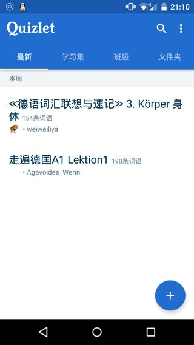
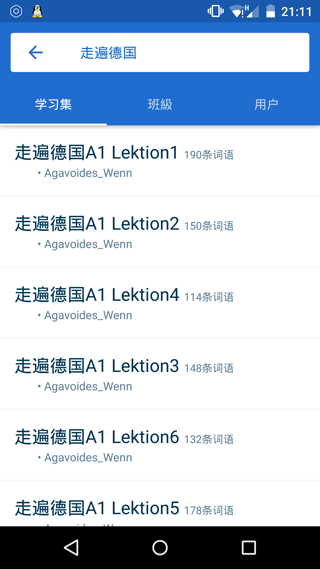
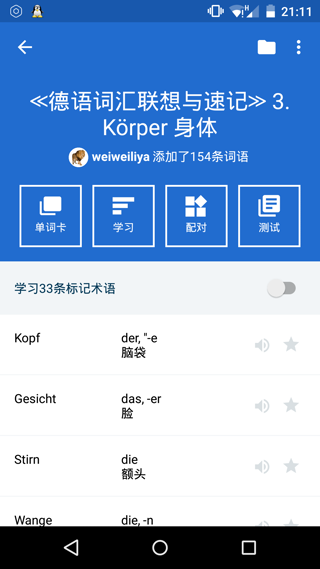
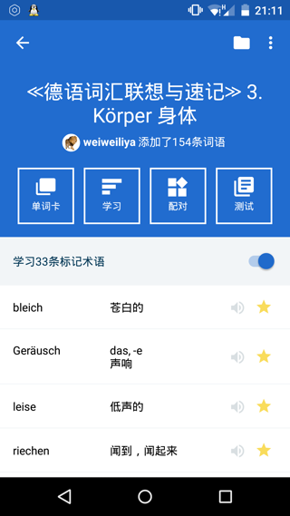
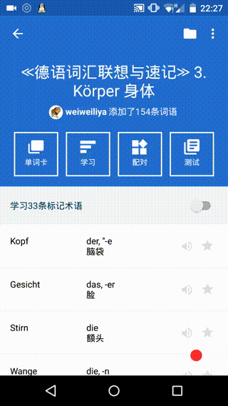
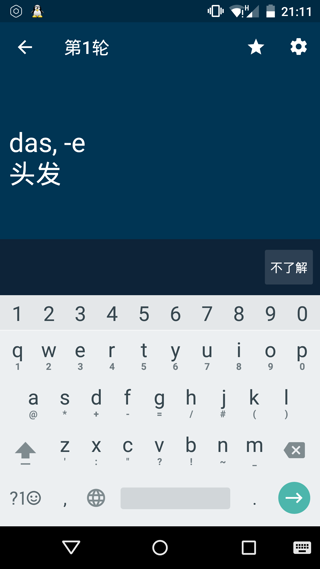
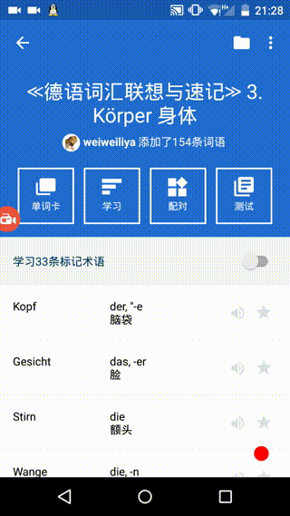
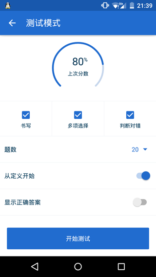

# 关于Quizlet
- 作为一位德语学习者，我一直没有找到一款满意的背词软件(如英语的百词斩和拓词之类)。无意之中我遇到了Quizlet，使用不到五分钟我就意识到这就是我想要的！！！
- 严格来说它并不是一款通常的背词软件而是一款**单词卡**软件，不过无数学习者的补充让它焕发出如同开源库般的魅力.
- 其实不光德语，基本**所有语言**单词的记忆这款软件都有涉猎。通过简单的内部搜索我们可以很快获取到**前人创建的单词集**，从而立刻开始单词的记忆。令我感到惊喜的是它的词库异常的齐全，在德语方面：走遍德国，柏林广场，新编大学德语甚至到我刚买的德语词汇联想与记忆，应有尽有，完全按照课程进行了封装。此外，单词卡的自动发音功能，测试功能，学习功能，匹配功能也使记忆的过程变得异常高效

# 软件介绍
## 主界面
- 主界面是各种词库 学习集 文件夹的管理
- 
- 点击右上角的查询按钮可以查询各种单词集<**精通16国外语**>
- 

## 学习集界面
- 进入学习集后可以看到如下界面，分别是你在学习集中做的标记和学习测试状况
- 
- 通过开关的切换可以让显示全部单词和我已标记的单词
- 
- 点击单词卡即可，单词卡界面显示语言和隐藏语言都可以进行设置，并且在滑动过程中会自动进行单词发音！fantastisch！！
- 
- 学习界面是通过默写了解的单词和背诵不了解(点击不了解)的单词来对单词记忆进行进一步强化
- 
- 配对是以计时小游戏的方式来对单词灵敏度进行训练==每次都慢半拍 也可以对标记单词进行配对训练
- 
- 测试的话是自己设置考核类型和题数 系统随机抽单词进行考核
- 

> 总的来说，这款软件已经充分满足我单词方面的需求，缺陷就是例句有所缺乏，不过搭配德语助手还是不错的 > <
