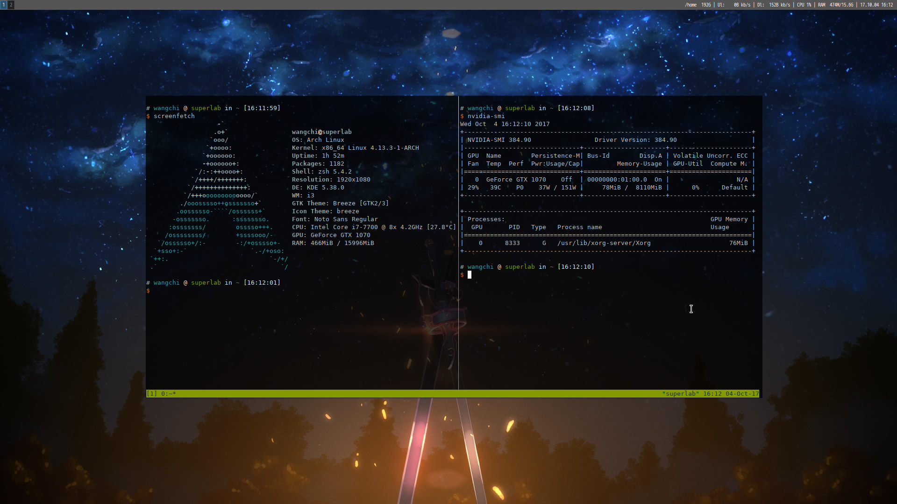

# 引言
Arch算起来已经用了3年多了，是我使用最久的一款Linux发行版。现在换了Mac，Linux使用频率大幅下降，因此把Arch环境的安装以及配置记录下来以供参考。
//至于为什么不直接使用安装脚本，因为硬件老变啊hhh还是针对性安装毕竟安心
<!-- more -->


# 安装计划
## 当前硬件

- GPU Intel I7-7700
- GPU VSUS NVIDIA GTX1070
- 机械硬盘 WD10EZEX 1T
- 固态硬盘 PLEXTOR M7VC 256G
- 内存 海盗船复仇者LPX DDR4 3000 16G

## 硬盘规划
> 由于主要打算用Linux跑神经网络，包含很多小文件，因此SSD全用来装Linux来加速文件存取。机械硬盘1T一半用来装Windows，一半用来做Linux额外存储空间（非`/home`）。

```
SSD
├── /boot  1G
├── /Swap 16G
└── /  剩下全部（/home不单独分了）

机械硬盘
├── Windows 512G
└── Linux 剩下全部（exfat）
```


# 前期

## 准备
- **Arch启动盘一枚** - 在官网和国内镜像站都能下，一般几百MB
- **网络环境** - 由于Arch滚动更新，新的系统组件都是直接从网上下载的，因而需要相应网络环境（网线/WIFI）//当然也可以自己搭建本地库
- [**Arch Installation guide**](https://wiki.archlinux.org/index.php/Installation_guide) - 嗯，Arch的文档是最好的！

## 分区
一般分`/Boot`、`swap`和`/`就行了，如果具有强迫性或者双硬盘的话可以分下`/home`。MBR使用*fdisk*或者*cfdisk*，GPT使用*gdisk*或者*cgdisk*。

获取各盘区信息
```Bash
$ lsblk
```

对sda盘分区，记得给`/boot`分区设`ESP`类型
```Bash
$ cgdisk /dev/sda
```
此时分区表如下
```Bash
$ lablk
NAME   MAJ:MIN RM  SIZE RO TYPE MOUNTPOINT
sda      8:0    0   64G  0 disk
├─sda1   8:1    0    1G  0 part
├─sda2   8:2    0   16G  0 part
└─sda3   8:3    0   221.5G  0 part
```

初始化
```Bash
$ mkfs.vfat /dev/sda1
$ mkswap /dev/sda2
$ mkfs.ext4 /dev/sda3
```

挂载
```Bash
$ mount /dev/sda3 /mnt
$ swapon /dev/sda2
$ mkdir -p /mnt/boot
$ mount /dev/sda1 /mnt/boot
```

# 安装系统
## 选择镜像源
选一个看的顺眼的China镜像放前面即可
```Bash
$ vim /etc/pacman.d/mirrorlist
```

强制更新源
```Bash
$ pacman -Syy
```

## 安装基础包
此时u盘启动镜像为`/`,待安装系统为`/mnt`，使用`pacstrap`命令将基础系统装进`/mnt`中
```Bash
$ pacstrap /mnt base
```

根据需要安装其他包
```Bash
$ pacstrap /mnt base-devel vim zsh zsh-completions
```

## 配置系统
### 生成fstab
生成`fstab`文件，用以定义硬盘信息
```Bash
$ genfstab -U /mnt >> /mnt/etc/fstab
```

### 进入系统
使用`arch-chroot`进入系统
```Bash
$ arch-chroot /mnt /bin/zsh
```

### 编辑时区信息
设置时区并设置硬件时钟
```Bash
$ ln -sf /usr/share/zoneinfo/Asia/Shanghai /etc/localtime
$ hwclock --systohc --utc
$ tzselect
```

### 设置语言环境
选择`/etc/locale.gen`文件中需要的语言环境，去除注释
```Bash
$ vim /etc/locale.gen
```

我使用的是

- en_US.UTF-8 UTF-8
- zh_CN.UTF-8 UTF-8
- zh_TW.UTF-8 UTF-8

生成它们
```Bash
$ locale-gen
```

写入默认语言配置
```Bash
$ echo LANG=en_US.UTF-8 > /etc/locale.conf
```

### 设置主机名
```Bash
$ echo myhostname > /etc/hostname
$ echo '127.0.1.1	myhostname.localdomain myhostname' >> /etc/hosts
```

### 设置root密码
```Bash
$ passwd
```

### 安装启动引导
安装`Grub`
```Bash
$ pacman -S grub efibootmgr os-prober
```

安装`Grub`引导（`esp_mount`一般为 `/boot`或`/boot/EFI`）
```Bash
$ grub-install --target=x86_64-efi --efi-directory=esp_mount --bootloader-id=grub
```

使用`os-prober`自动配置`grub.cfg`
```Bash
$ grub-mkconfig -o /boot/grub/grub.cfg
```

### 新建用户
新建用户并设置密码
```Bash
$ useradd -m -g users -G wheel -s /bin/zsh username
$ passwd username
```

[可选]给`wheel`组`root`权限
```Bash
$ vim /etc/sudoers
去除其中"%wheel ALL=(ALL) ALL"行注释即可
```

## 桌面
### xorg框架
```Bash
$ pacman -S xorg-xclock xterm xorg-utils xorg-xinit xorg-server
```

### 显卡驱动（NVIDIA GTX1070）
慎重！
由于工作站主要任务是进行模型训练，因此采用私有驱动已获得最好的性能。日常使用的话采用开源驱动即可。
```Bash
$ pacman -S nvidia nvidia-utils
```

重启！
### 安装KDE Plasma桌面
由于配置充足，直接上KDE全家桶
```Bash
$ pacman -S plasma-meta kde-applications-meta kde-l10n-zh_cn kde-l10n-en_gb
```

启动sddm服务
```Bash
$ systemctl enable sddm.service
$ systemctl start sddm.service
```

###启动网络服务
```Bash
$ systemctl enable NetworkManager.service
$ systemctl start NetworkManager.service
```

# 基础软件安装
## [oh-my-zsh](http://ohmyz.sh)
```Bash
$ sh -c "$(curl -fsSL https://raw.github.com/robbyrussell/oh-my-zsh/master/tools/install.sh)"
```

## 字体
```Bash
$ pacman -S wqy-zenhei wqy-microhei wqy-bitmapfont freetype2
```

## 网络
由于net-tools曾属于base组后来被移除了，很多实用的网络工具都需要自己单独安装才可以使用
```Bash
$ pacman -S net-tools
```

## 安装AUR包管理器
> 自行查看[archwiki](https://wiki.archlinux.org/index.php/AUR_helpers)，我习惯用yaourt

## 安装视频播放器
```Bash
$ pacman -S vlc mplayer
```

## 安装网易云音乐
```Bash
$ yaourt -S netease-cloud-music
```

## 安装输入法
```Bash
$ pacman -S fcitx fcitx-rime fcitx-configtool fcitx-gtk2 fcitx-gtk3 fcitx-qt4 fcitx-qt5 kcm-fcitx
```

设置环境变量
```Bash
$ vim /etc/environment

追加以下内容
GTK_IM_MODULE=fcitx
QT_IM_MODULE=fcitx
XMODIFIERS=@im=fcitx
```

# 后记
此时桌面效果如下图，可见GPU私有驱动已被完美安装，而且系统整体运行良好。（忽略乱入的i3wm）



更详细的配置见配置篇
