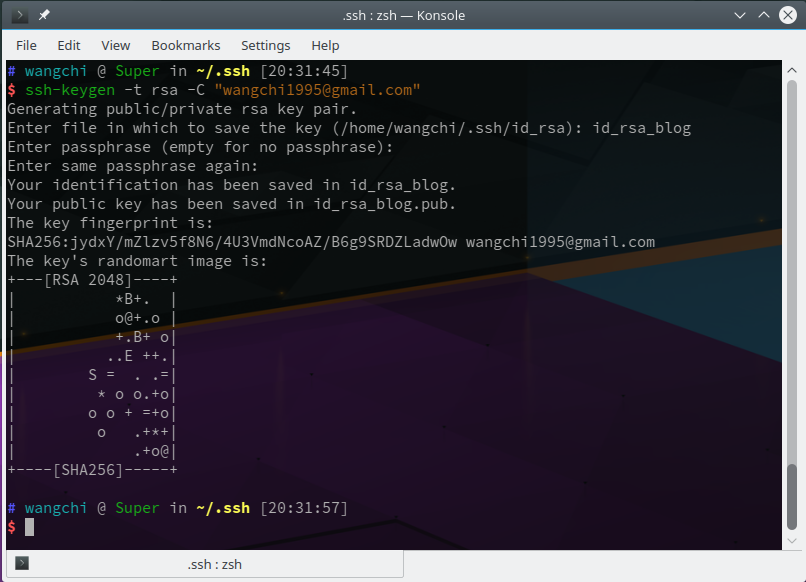
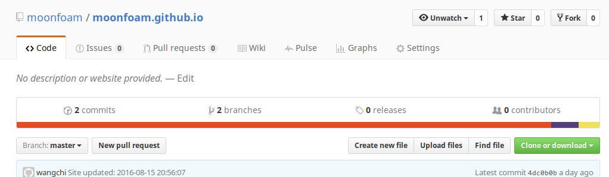
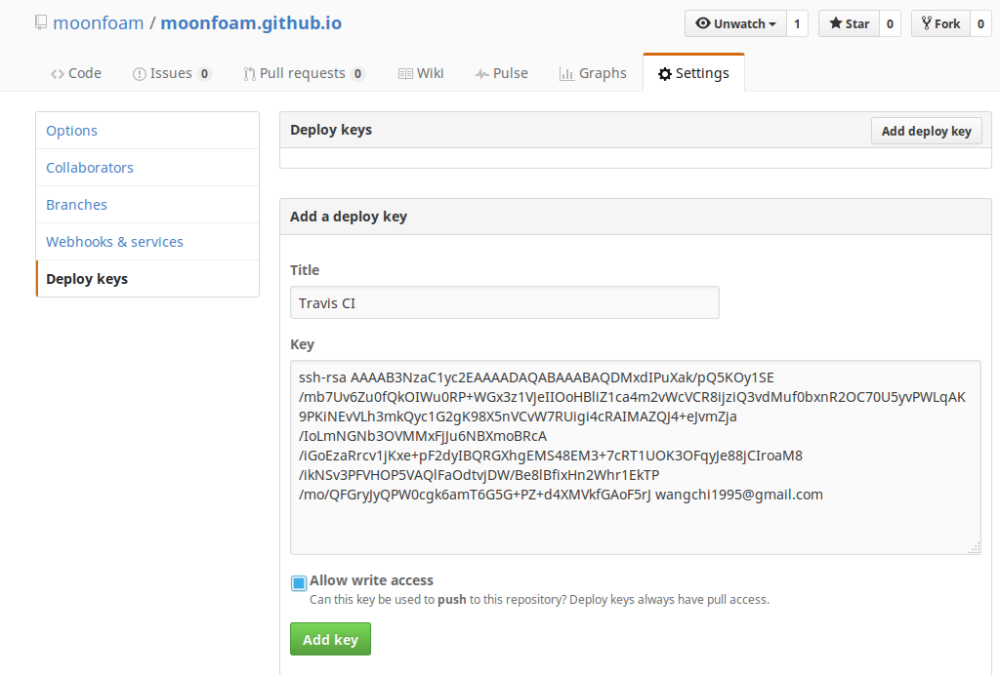
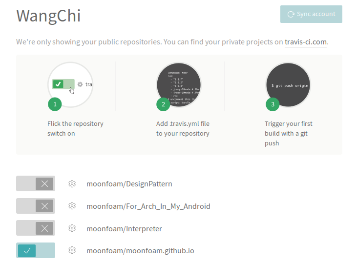
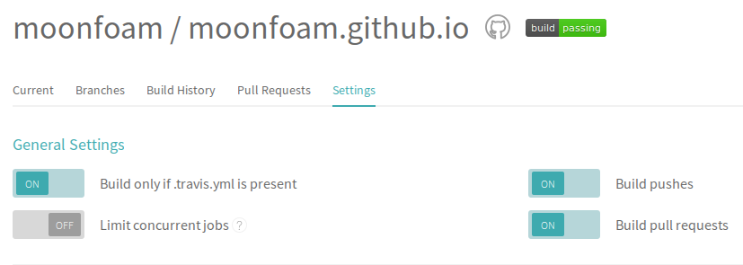
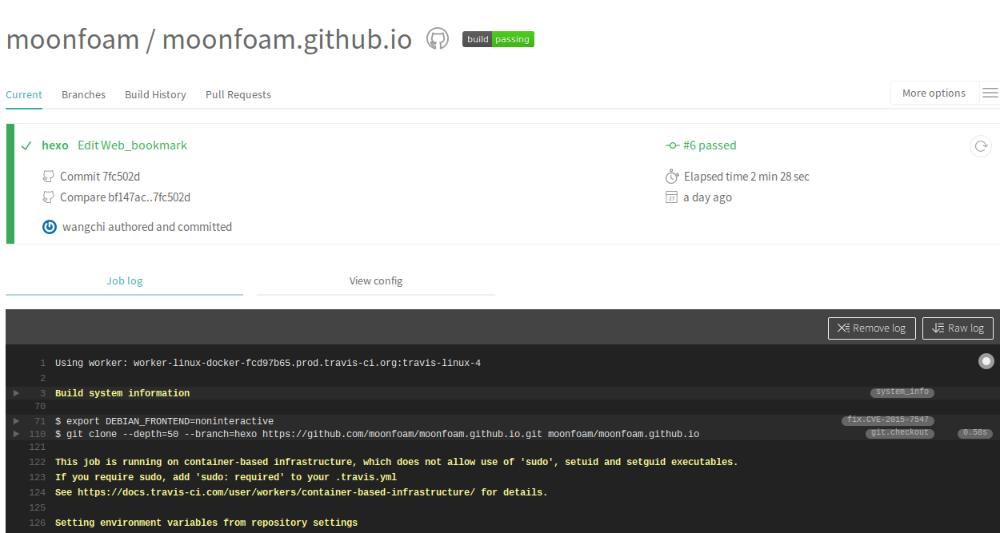

# 引言
Hexo之类的静态博客相对与类WP的动态博客而言无疑有诸多优势，如重新搭建，简单安全，速度快等有点，连评论，统计，搜索等相对动态的功能都可以通过外链插件得以实现。<br/>
但有一个缺点无法避免，就是在不同电脑上写博客会很不方便。最近终于发现了一个较为不错的解决方案-使用Travis CI实现源码同步到Github上时自动生成并部署。尝试了下无比好用！立马写博文以记:)
<!-- more -->

> 参考自：
> - <http://www.jianshu.com/p/7f05b452fd3a>
>
> 注：Windows使用该方法在加密处可能会有问题(长度问题)，可采用[此博客]( http://www.jianshu.com/p/fff7b3384f46)方法解决，Mac和Linux无碍


---

使用Hexo也有一段时间了，从动态博客转到静态博客感觉不错(由于懒得备份数据库==),表示屯着源代码无比有安全感。尝试了基于Ruby的OctoPress后再用基于Nodejs的Hexo第一个感觉就是快！用起来也很舒服(转Hugo计划无限延期)，稍微配置下就能做的很好看了。一直打算写一个Hexo教程，也因为一直很忙+系统没挂而搁浅，下次抽空写吧。

---

# 正文

## 配置ssh密钥
### 生成博客专属ssh密钥
可以使用全局的ssh密钥，不过便于区分(防止重装系统后误以为密钥没用删了Github上的公钥==)，生成单独的专属密钥
```
# 切换到.ssh目录
cd ~/.ssh
# 生成密钥，后面邮箱换成自己的邮箱
ssh-keygen -t rsa -C   "wangchi1995@gmail.com"
```
输入以上命令后回车，显示**Enter file in which to save the key (/home/wangchi/.ssh/id_rsa):** 时(第一个问题) 写入**要保存的路径及文件名** ,注意不要写全局密钥(如~/.ssh/id_rsa)，其余一路回车就行。<br/>
过程如下图：<br/>
<br/>
<p align=center>密钥生成成功</p>

### 添加ssh到github
登录到github,进入自己的github.io项目 <br/>
<br/>
然后点击**Settings** -> 左侧**Deplog Keys** -> **Add deploy key** , **Title** 随意写，**Key** 写刚刚生成的公钥内容(如我的公钥内容在**~/.ssh/id_rsa_blog.pub**文件中)<br/>
<br/>
然后勾选**Allow write access**赋予可写权限后点击最下面**Add key**按钮即可

### 编辑配置信息

> 这个随意，反正我全部部署完后直接把自己电脑上的**id_rsa_blog**删了

用编辑器打开config文件，添加如下信息：
```
# github
Host github.com
  HostName github.com
  PreferredAuthentications publickey
  IdentityFile ~/.ssh/id_rsa
# 这里是空行
# github_blog
Host github.com
  HostName github.com
  PreferredAuthentications publickey
  IdentityFile ~/.ssh/id_rsa_blog
```

## 配置Travis
### 接入Travis CI
打开[Travis CI](https://travis-ci.org/)网站，使用github账号登录<br/>
将鼠标放在右上角的用户名上，点击**Account**选项，会显示github的项目。<br/>
找到博客项目(xxx/xxx.github.io)，点击前面带有 **X** 符号的按钮，开启travis支持。<br/>
<br/>
然后点击前面按钮边上的**设置小齿轮**，设置成如下样子就行了<br/>
<br/>

### 安装travis
安装Ruby环境以及rubygems插件<br/>
```
# ArchLinux下如下安装
sudo pacman -S ruby
```
然后使用**gem命令**安装travils<br/>
```
# 安装travis
gem install travis
```

### 新建配置文件
首先打开博客项目文件夹，在项目根目录新建**.travis.yml**配置文件<br/>
```
# 打开博客项目文件夹根目录
cd BlogRootPlace
# 创建配置文件
touch .travis.yml
```

### 复制ssh私钥
在项目根目录创建文件夹.travis<br/>
```
mkdir .travis
```
将前面生成的ssh密钥文件**id_rsa_bolg**复制到**.travis**文件夹下<br/>
```
cp ~/.ssh/id_rsa_blog .travis/
```

### ssh配置文件
这个ssh配置文件是用于在部署机器上(远程Travis CI)使用的，不是本地的ssh配置文件，后面的travis配置文件会用到。<br/>
在.travis文件夹中新建文件**ssh_config**<br/>
```
$ touch .travis/ssh_config
```
编辑配置文件，添加如下内容：<br/>
```
Host github.com
  User git
  StrictHostKeyChecking no
  IdentityFile ~/.ssh/id_rsa
  IdentitiesOnly yes
```

### 登录travis
```
travis login --auto
```
然后会提示输入github的用户名和密码(我连接的时候失败了很多次，有梯子的用梯子，没梯子的多试几次)


### 加密操作
> 毕竟源代码是要上传github的，总不能把私钥上传上去，否则所有人都有该项目修改权了。<br/>
因此对其加密并删除源私钥文件

在博客项目文件夹下对ssh的私钥进行加密<br/>
```
# 加密私钥
travis encrypt-file .travis/id_rsa_blog .travis/id_rsa_blog.enc --add
# 删除私钥
rm .travis/id_rsa_blog
```
此操作会生成加密之后的秘钥文件 id_rsa_blog.enc，**删除id_rsa_blog密钥文件**(私钥不能随便泄露)。<br/>
此时在.travis.yml配置文件会出现如下几句:
```
openssl aes-256-cbc -K $encrypted_xxxxxxxxxxx_key -iv $encrypted_xxxxxxxxxxx_iv
  -in .travis/id_rsa_blog.enc -out .travis/id_rsa_blog -d
```

## 编辑配置文件
### Travis配置文件
打开Travis配置文件.travis.yml，添加和修改如下信息：<br/>
**关注井号注释内容并作相应更改！！！**<br/>
```
language: node_js
node_js:
- "6"  # nodejs的版本
branches:
  only:
  - hexo  # 设置自动化部署的源码分支
before_install:
- export TZ='Asia/Shanghai'  # 设置时区
- npm install -g hexo
- npm install -g hexo-cli
- openssl aes-256-cbc -K $encrypted_xxxxxxxxxxx_key -iv $encrypted_xxxxxxxxxxx_iv
  -in .travis/id_rsa_blog.enc -out ~/.ssh/id_rsa -d
#  -in .travis/id_rsa_blog.enc -out .travis/id_rsa_blog -d
# 我把解密生成的私钥放到服务器的 ~/.ssh 文件夹了，也可以和初始设置一样，要注意的是前后的文件夹以及文件名要对应
# 设置id_rsa文件权限
- chmod 600 ~/.ssh/id_rsa
# 添加ssh密钥
- eval $(ssh-agent)
- ssh-add ~/.ssh/id_rsa
# 添加ssh配置文件
- cp .travis/ssh_config ~/.ssh/config
# 设置github账户信息
- git config --global user.name "wangchi" #设置github用户名
- git config --global user.email wangchi1995@gmail.com #设置github用户邮箱
# 安装依赖组件
install:
- npm install
# 执行的命令
script:
- hexo clean && hexo g -d
```
### 编辑Hexo配置
由于我以前编辑过，略过，格式如下。<br/>
需要注意的是:
  - repo处要填**SSH key**地址(即git@github.com:xxxxx)
  - branch处填要发布的分支

```
deploy:
- type: git
  repo: git@github.com:moonfoam/moonfoam.github.io.git
  branch: master
```

## 测试
push本地的代码至远程仓库之后，在[Travis CI](https://travis-ci.org)后台查看相关情况<br/>
如下图所示即成功部署Hexo:<br>
<br/>
