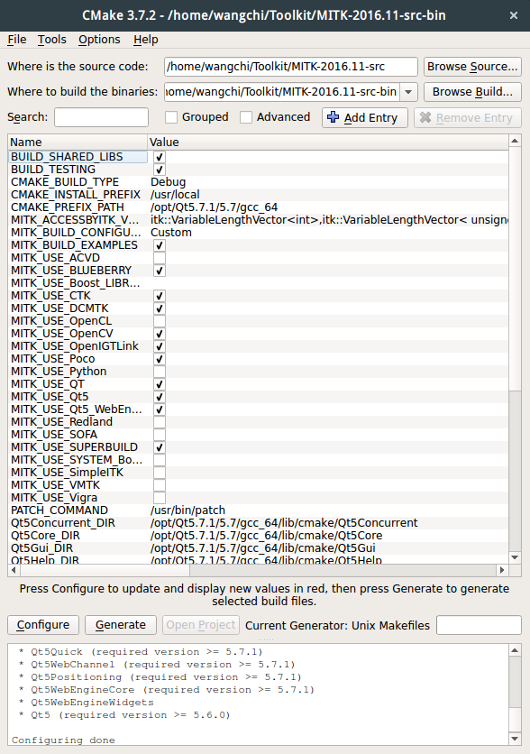
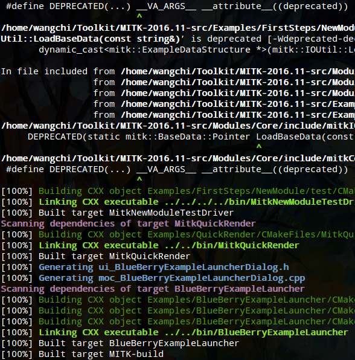
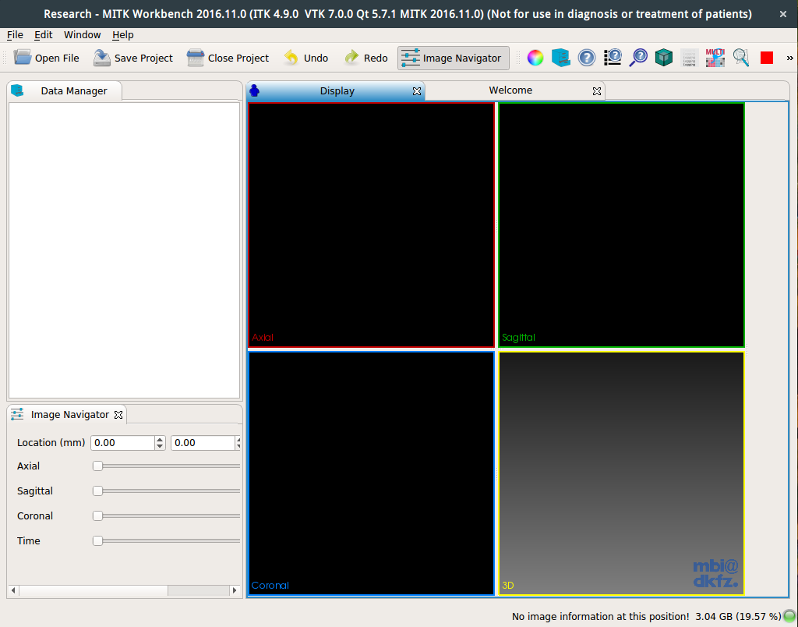

# 引言
毕设的项目需使用[MITK\(The Medical Imaging Interaction Toolkit\)](http://www.mitk.org/)套件来进行医学图像处理，因此开始了MITK的踩坑计划，国内外网上的安装贴都无比的少，经过两天的折腾终于把MITK编译成功了！作文以记。  
注：本文使用的MITK为2016.11德国版
<!-- more -->

# 前置下载
## Ubuntu16.04LTS
[支持的平台](http://docs.mitk.org/2016.11/SupportedPlatformsPage.html)，Linux系的官网支持列表如下：

| Platform                   | Compilers                                          |
|----------------------------|:---------------------------------------------------|
| Ubuntu Linux 14.04 \(x64\) | GNU 4.9 as provided by ppa:ubuntu-toolchain-r/test |
| Ubuntu Linux 16.04 \(x64\) | GNU 4.9                                            |

为了稳定性以及团队合作各软件版本的统一，重新装回Ubuntu还是很有必要的。

## 所需软件
- [MITK2016.11](http://docs.mitk.org/2016.11/)，下载点[此处](http://www.mitk.org/download/releases/MITK-2016.11/MITK-2016.11-src.tar.gz)
- QT5.7.1，下载点[此处](http://download.qt.io/archive/qt/5.7/5.7.1/qt-opensource-linux-x64-5.7.1.run)
> // 加可写权限  
> chmod +x ./qt-opensource-linux-x64-5.7.1.run  
> // 图形化安装  
> sudo ./qt-opensource-linux-x64-5.7.1.run
- Cmake3.7.2，下载点[此处](https://cmake.org/files/v3.7/cmake-3.7.2-Linux-x86_64.tar.gz)
> 解压后打开*bin*文件夹下的**cmake-gui**即可

# 编译安装
1. 解压MITK-2016.11-src.tar.gz
2. 新建一个文件夹*Toolkit*，把解压完的文件夹放进去，再新建一个文件夹*MITK-2016.11-src-bin*用以存放编译完的二进制文件，大致目录如下
> Tookit    
> ├─ MITK-2016.11-src  
> └─ MITK-2016.11-src-bin
3. 打开Cmake-gui或者命令行ccmake生成makefile
 

Figure 1. Cmake-gui

  1. **source code路径**填*MITK-2016.11-src*文件夹路径
  2. **binaries路径**填*MITK-2016.11-src-bin*文件夹路径
  3. 点击下方**Configure**，选默认的，发现一堆红的，把**QT5-DIR**路径填上\(用上面命令安装的默认路径应该是*/opt/Qt5.7.1/5.7/gcc_64/lib/cmake/Qt5`*)
  4. 再点下**Configure**，勾上**MITK_USE_OPENCV**和**MITK_USE_OPENGTLink**，其他看需要勾选
  5. 再点**Configure**到无错误且无红色为止(否则安装缺少的包)
  6. 点击下方**Generate**即可
4. 打开终端，进入*MITK-2016.11-src-bin*文件夹
> make  
> // 如果多核可以使用**make -j6**使用多核编译加快编译速度
5. 见到如下界面即编译成功
 

Figure 2. make

6. 打开*MITK-2016.11-src-bin/MITK-build/bin/MitkWorkbench*,即可见到如下界面：
 

Figure 3. MITK

注：**make**编译期间特别慢，可考虑以下方式优化：
1. **make**期间需下载大量文件，若网速不行可考虑先用**axel**下载文件再覆盖
2. 使用**make -j6**多核加速
