# 基本语法

## 标题
- Setext Style
> 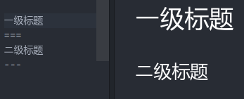

<!-- more -->

- Atx Style:句首加#，注意#后的空格
> 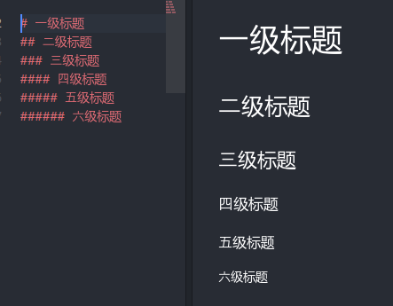

## 列表
- 有序列表:在每行文字前加"1. ",注意空格
> 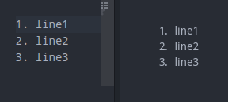

- 无序列表:在每行文字前加"*/+/- ",注意空格
> 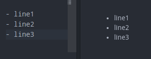

## 引用
- 在每行文字前加"> ",注意空格
> 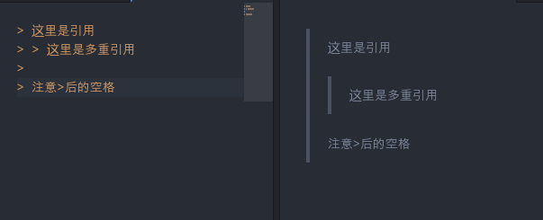

## 链接与图片
- 链接
> 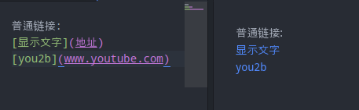

- 图片
> 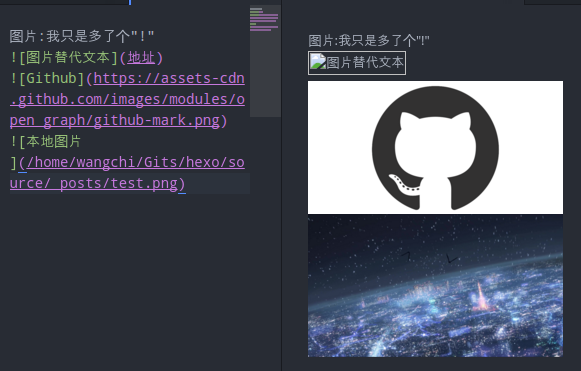

## 表格
- 第一行为标题，第二行为格式化列(其中--数目随意)
  - :---- 左对齐
  - :---: 居中
  - ----: 右对齐

> 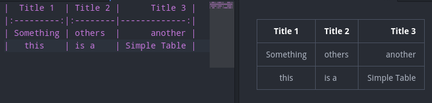

## *斜体*和**粗体**
- 所需变换文字两边各加一个\*或者\_为斜体，各加两个\*或者\_为粗体
> 

## 删除线
- 在所需删除文字两边加\~\~
> \~\~删除线\~\~  
> ~~删除线~~

## 区块
- 可视为保留近乎所有格式的内容，可用以下方式实现
  1. 每行开头空四格
  > 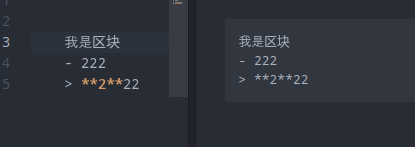
  2. 使用\` something \`包含 ，多行使用\`\`\` something \`\`\`包含
  > 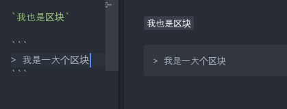

## 分割线
- 单独一行用\*\*\*或者\+\+\+表示
> 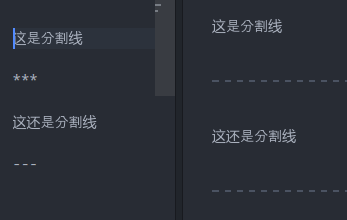

# 技巧

> 大多数技巧采用HTML语言间接实现

## 转义字符
- 普通:加反斜杠得以实现
  - \\\      -> \\
  - \\\`     -> \`
  - \\\*     -> \*
  - \\\_     -> \_
  - \\\{\\\} -> \{\}
  - \\\[\\\] -> \[\]
  - \\\(\\\) -> \(\)
  - \\\#     -> \#
  - \\\+     -> \+
  - \\\-     -> \-
  - \\\.     -> \.
  - \\\!     -> \!
- 特殊:
  - 表格内的|: 使用 **\&\#124;**代替
  - `===` : 使用块注释\`===\`
## 上下标
- 上标: 使用\<sub\>\*\</sub\>
  - z.B. H\<sub\>\*\</sub\> -> H\*
- 下标: 使用\<sup\>\*\</sup\>
  - z.B. H\<sup\>\*\</sup\> -> H\*

## 带()链接-Reference链接
- Markdown有两种链接方式：**Inline**以及**Reference**
> Inline:
> \[Youtube\]\(https://www.youtube.com\)
> Reference:
> \[Youtube\]\[url\]
> \[url\]:https://www.youtube.com

- 自动链接
  - 使用尖括号<>包含住一段地址或者邮箱
  - <https://www.youtube.com>

## 数学公式latex
- 使用<latex.codecogs.com>生成的图片
- \!\[\]\[latex\]
- \[latex\]:http://latex.codecogs.com/gif.latex?\sum_{i=1}^n&a_i=0
> ![][latex]
[latex]: http://latex.codecogs.com/gif.latex?\sum_{i=1}^n&a_i=0
