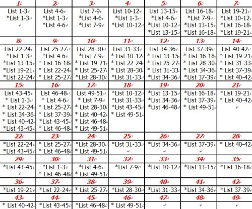

> 偶尔看到的方法，感觉神好用(宗旨就是死缠烂打背单词+付出努力不浪费><)，虽然原文是关注GRE的，不过其他的也可以触类旁通 MARK！
 <!-- more -->
> 摘自
> - (https://www.douban.com/group/topic/36403218/?r=1)
> - (http://learning.sohu.com/20081214/n261202653.shtml)

------------------切入主题！--------------------

# 背的原则[两个中心]
1. 第一遍过单词时只要**模糊**识别单词长啥样跟**主要词义**即可，不抠发音跟拼写（这些在以后的n次重复中自然会记住的~）
2. 过第四遍（也就是背完新单词后的第一遍起，详见后面附的时间表）才开始看**英文释义**、第五遍看**例子**、第六遍加上同**反义词**

# 背的策略[三个基本点]
1. 一定要在**早上**背单词（最迟10点，原因待会儿说），**背一面（5min)马上复习一次**（每一面都这样背），然后**背完六面（30min到)马上从第一面起复习一次**，不管G还是T一个list都大概是11——12面，后面5~6面用一样的方法解决，所以一个list一小时干掉（30min*2=1h)，一上午背三个list总共3小时。
2. 晚上，也就是**十二个小时以后开始复习**（这就是为啥要早上背单词的原因，12小时记忆周期到了好复习~不然就只能在梦中复习了==），此时每个list大概需要20分钟左右即可过完。（其实这一块是最最痛苦的，因为到后期复习量最大的时候一天复习15个list要5个小时)【注：每天与单词纠缠的总时间约为四到八小时】
> 对于绝大多数的同学来讲，这一遍复习只需要第一遍背单词的不到三分之一的时间，即每个List小于或等于20分钟，3个List在50～60分钟之间，注意请读者把这一遍**复习的顺序与早晨初背的顺序作一个调换**，如早晨的顺序是List1，List2，List3，则这一遍请调整为List2，List3，List1，其目的在于**根本克服前摄抑制和后摄抑制的问题**。在以后的复习当中，读者可以根据自己的情况灵活地调整复习地顺序，把以前记得最不清楚地部分放到自己记得最牢固地位置。
3. 如果背的是GRE的话，十七天过后，新单词已全部背完，这时候一定别得意忘形要乖乖复习不然那十七天就白背了！不过压力不大的，每天抽45分钟复习3个list就可以保证长期记忆了
4. 每次复习的方法都应该是**只看英文单词**，遮住中文释义，想这个单词的意思。如果你想不出来或是想错了就意味着这个单词没记住，需要重点记忆。复习的遍数越多，记不住的单词就越少，复习的速度也将会越来越快。按照笔者的背词法，12个小时的那一次复习，第一次复习的时候一个List需要20分钟；到了15天的这个复习周期，大约只需要15分钟。等到读者什么时候可以在10分钟内复习完一个List背单词的第一关已经完全通过了。尤其需要注意的是，在每一次复习的时候，切切不可放任自己偷懒，即：不遮住中文释义以试图回忆该英文单词的意思，而是简简单单的中，英文又重读一遍，这种复习的方法速度虽快，但是远远达不到笔者所要求的复习效果。因为从记忆的规律来讲，试图回忆是一种比简单重复学习更为积极的过程，可以使记忆过程中更为专心，因为每一次复习过程都是一次小的记忆测试，为了能够在下一个复习点到来时可以回忆起该单词，背词者必须在记忆每一个单词的时候都更为集中精力地记忆。换句话说，这种试图回忆地复习标准更具挑战性，既加强了背单词地效果，又增加了背单词地乐趣。不但如此，使用这种复习标准地背单词者还可以更有这对性地找出那些尚不能回忆或者回忆有误的地方，然后更为有效地解决这些问题。
5. 请记住一点，那就是**复习比背新词重要**。如果时间实在安排不开，宁可不背新词，但是一定要完成复习的任务。

>【注1：这个方法牛就牛在它在你背单词的所有记忆周期设计了复习，分别是与某单词初次相逢以后的**第5、30、60分钟,12小时，1、2、4、7、15、30天**，一个流程走下来一个单词你憋了10遍吖亲~而且全卡在遗忘点有木有~~~这种背法猪都能记住啊，Ornithorhynchidae这种非人类单词也能斩落马下啊有木有~杨鹏吊爆了有木有~】

>【注2：由于此方法的特殊性，需要大家在**假期**进行，平时是很难做到的因为要求时间长而且很耗神很折寿，但真心很有效，是短期内永久扩大词汇量的好办法（对于词汇量小的童鞋来说一个假期扩大4~5千是没问题的）。但很不幸，还想说一个事实，那就是只有30%不到的人能坚持下来，大部分人中途退出了，原因主页菌就不分析了大家都懂得，希望大家勇敢地当那30%~】

>【注3：对于大家对此方法的怀疑，杨鹏本人、主页菌及一大批出国人都亲身实践过，真的可行，大家不妨把它当做是一个考验，考验自己到底有没有出国追梦的勇气和决心。因为G的难度是天理难容的所以背的时候情绪会经常面临崩溃，在情绪快崩溃的时候一定要发泄出来不要带着情绪背单词，这个方法因人而异只要不针对周围的人发脾气就好，主页菌当时是用五月天的歌疗伤的。。。当时一起拼命的一个好朋友用的方法是抡枕头砸脑袋，据他本人说减压效果明显。。。】

---

最后再附上一个杨鹏本人当年背GRE单词的计划表吧（注：十七天后均为复习）~大家可以适当修改调成适合自己的，不必拘泥，牢记复习周期即可。

